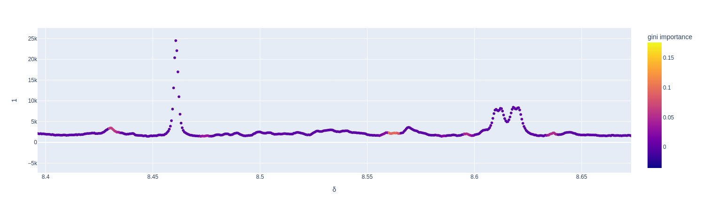

# LAVASET 

## TO DOUBLE-CHECK 
- gini calculation
- formate simulation data does not pick up the formate peak (trees=100, nn=10) and picks up noise instead as important
  
  - check the `_build` function for progressing nodes    
  - increase the number of trees? 

## TO ADD 
- unittest folder 

## Wishlist 
- fix random number of samples to take the REAL indexes of samples (found on `_generate_sample_indexes()`).
